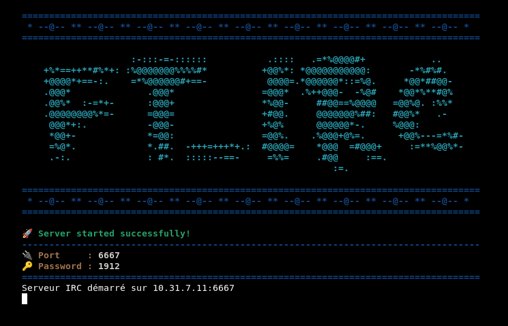

# ft_irc - École 42 | Paris

<div align="center">
  
  
  
  
  
</div>

###
<div align="center">
  
</div>

## Description

Le projet **ft_irc** consiste à développer un serveur IRC en respectant le standard IRC tout en utilisant le langage **C++98**. Le serveur doit gérer plusieurs connexions simultanées et fonctionner en mode non bloquant pour permettre une communication fluide entre les clients.

Vous devez tester votre serveur à l'aide d'un vrai client IRC pour garantir la compatibilité avec le protocole standard.

## Objectifs

- Reproduire le fonctionnement d'un serveur **IRC** en C++98.
- Gérer plusieurs clients simultanément sans blocage.
- Implémenter les principales commandes IRC comme `NICK`, `USER`, `JOIN`, `PRIVMSG`, etc.
- Fournir un système d'authentification via un mot de passe à la connexion.
- Supporter les opérateurs de canal et les commandes associées comme `KICK`, `INVITE`, `TOPIC`, et `MODE`.

## Fonctionnalités

- **Communication TCP/IP** : Utilisation des sockets pour la communication entre le serveur et les clients via le protocole **TCP/IP** (v4 ou v6).
- **Gestion des canaux** : Le serveur doit permettre la création et la gestion de canaux IRC, avec la possibilité d'envoyer des messages privés ou dans des canaux.
- **Non-bloquant** : Toutes les opérations d'entrée/sortie (E/S) sont non bloquantes afin de ne jamais empêcher la gestion simultanée des connexions multiples.
- **Sécurité** : Utilisation d'un mot de passe pour sécuriser l'accès au serveur. Chaque client doit fournir le bon mot de passe pour pouvoir se connecter.
- **Support multi-clients** : Le serveur peut gérer plusieurs connexions simultanément sans aucun forking ou thread supplémentaire.

## Structure du Projet

```bash
.
├── incs
│   ├── Bot.hpp
│   ├── Channel.hpp
│   ├── Client.hpp
│   ├── IrcMessageBuilder.hpp
│   ├── IrcNumericReplies.hpp
│   └── Server.hpp
├── Makefile
├── README.md
└── srcs
    ├── Bot.cpp
    ├── Channel.cpp
    ├── Client.cpp
    ├── IrcMessageBuilder.cpp
    ├── main.cpp
    └── Server.cpp
```
## Compilation

Utilisez le **Makefile** pour compiler le projet avec les options de compilation requises. Le projet doit se compiler en utilisant C++98 avec les flags `-Wall -Wextra -Werror`.

**Commandes disponibles :**
```bash
make        # Compile le projet
make clean  # Supprime les fichiers objets
make fclean # Supprime les fichiers objets et les binaires
make re     # Recompile le projet
```

## Lancer le serveur :
```bash
./ircserv <port> <password>
```
- **Arguments** :
  - `<port>` : Le numéro de port sur lequel le serveur écoutera.
  - `<password>` : Le mot de passe que les clients devront fournir pour se connecter.

## Aperçu du Serveur

Voici un aperçu de l'interface graphique du serveur ft_irc lors de son lancement :

<div align="center">
  
</div>

## Tests

Utilisez un client IRC tel que **nc** (netcat) ou un client IRC de référence pour tester la connectivité et les fonctionnalités du serveur.

Exemple de connexion avec **nc** :
```bash
nc <server_ip> <port>
```

### Exemple de commandes IRC supportées

- **NICK** : Changer le pseudonyme du client
- **USER** : S'authentifier sur le serveur
- **JOIN** : Rejoindre un canal
- **PRIVMSG** : Envoyer un message privé ou un message dans un canal
- **KICK** : Éjecter un client d'un canal (opérateurs uniquement)
- **INVITE** : Inviter un client à rejoindre un canal
- **TOPIC** : Changer ou afficher le sujet d'un canal
- **MODE** : Modifier les permissions d'un canal (opérateurs uniquement)

## Bonus

- **Bot IRC** : Possibilité d'ajouter un petit bot qui interagit avec les utilisateurs.
- **Transfert de fichiers** : Support de l'envoi de fichiers entre clients.

## Commandes Utiles
### Outils de Débogage et Diagnostic
- **Vérification des Connexions Actives sur le Port `<port>` avec `lsof` :**
  ```bash
  lsof -i :<port>
  ```
- **Forcer la Fermeture des Processus Actifs sur le Port `<port>` :**
  ```bash
  kill -9 $(lsof -t -i :<port>)
  ```
- **Fuites Mémoire et Vérification des Descripteurs Actifs pour `ircserv` (Port `6667`) via `Valgrind` :**
  ```bash
  valgrind --leak-check=full --show-leak-kinds=all --track-origins=yes --track-fds=yes ./ircserv 6667 1912
  ```
### Utilisation d’Irssi
- **Ouvrir le Fichier de Configuration d'`Irssi` avec `VS Code` :**
  ```bash
  code ~/.irssi/config
  ```
- **Se Connecter à un Serveur IRC Local sur le Port `6667` :**

  Dans `bash` :
  ```bash
  irssi
  ```
  Dans `irssi` :
  ```irssi
  /connect <server_ip> 6667
  ```
- **Se Connecter à un Serveur IRC Local sur le Port `6667` avec le Pseudo `Raf` et le Mot de Passe `1912` :**

  ```bash
  irssi -c <server_ip> -p 6667 -n Raf -w 1912
  ```
- **Pour Utiliser /RAWLOG OPEN ~/debug.log avec votre Serveur `IRC` :**

  Dans irssi :
  ```irssi
  /RAWLOG OPEN ~/debug.log
  ```
### Gestion des Adresses IP ###
- **Afficher les Adresses `IP` de l’Hôte :**

  ```bash
  hostname -I
  ```
- **Afficher l’Adresse `IPv4` de l’Interface `enp3s0f0` :**

  ```bash
  ip -o -4 addr show enp3s0f0 | awk '{print $4}' | cut -d/ -f1
  ```
    **Explication des Commandes :**
    
    - `ip -o -4 addr show enp3s0f0` : Affiche les informations d’adresse `IPv4` pour l’interface `enp3s0f0` en format compact.
    - `awk '{print $4}'` : Sélectionne la colonne contenant l’adresse `IP` avec le masque de sous-réseau.
    - `cut -d/ -f1` : Supprime le masque de sous-réseau pour ne garder que l’adresse `IP` pure (ex., `10.31.6.11`).
- **Extraction de l’Adresse `IP` Principale :**

  ```bash
  hostname -I | awk '{print $1}'
  ```
### Adresse `IP` pour les transferts DCC

- **Observation** :
  Votre configuration indique `hostname = "127.0.0.1"` dans les paramètres du core. L'adresse `127.0.0.1` est l'adresse de bouclage (*localhost*) et n'est pas accessible depuis d'autres machines sur le réseau.

- **Solution** :
  Définissez votre adresse `IP` externe ou locale correcte en utilisant la commande suivante dans `Irssi` :
  ```irssi
  /set dcc_own_ip votre.adresse.ip
  ```
  Remplacez votre.adresse.ip par votre adresse IP réelle sur le réseau (par exemple, 192.168.1.17).

- **Résultat** : Cette commande ajoutera automatiquement l'entrée suivante dans votre fichier de configuration ~/.irssi/config :
  ```
  "irc/dcc" = { dcc_own_ip = "192.168.1.17"; };
  };
  ```

### Envoi de fichier.
#### Avec `irssi` :
- **Envoyer un Fichier avec `DCC` :**

  ```irssi
  /dcc send Pol /mnt/nfs/homes/raveriss/Desktop/Sender/test.txt
  ```
- **Recevoir un Fichier avec `DCC` :**

  ```irssi
  /dcc get Raf test.txt
  ```

#### Avec `nc` :


- **1. Sur le client expéditeur (`Raf`) :**

  Ouvrez un terminal et placez-vous dans le répertoire du fichier :

  ```bash
  cd /mnt/nfs/homes/raveriss/Desktop/Sender/
  ```
  Lancez `netcat` en écoute sur un port dédié, par exemple `12345` :
  ```bash
  nc -l 12345 < test.txt
  ```
 
- **2. Sur le client récepteur (`Pol`) :**

  Lancez la commande suivante pour vous connecter à `Raf` et recevoir le fichier :

  ```bash
  nc 10.31.6.11 12345 > test.txt
  ```
    - `10.31.6.11` : Adresse `IP` de `Raf`.
    - `12345` : `Port` fourni par `Raf`.


### Navigation dans irssi
Pour passer de l'écran d'une conversation privée à la page d'accueil d'`Irssi` (généralement appelée "fenêtre active par défaut" ou "fenêtre 1") :

- Appuyez sur `Alt + 1` ou `Esc` suivi de `1` pour retourner à la fenêtre 1, qui est souvent la page d'accueil ou le canal principal.
  
- Appuyez sur `Alt + flèche gauche` ou `Alt + flèche droite` pour naviguer entre les fenêtres.
Vous pouvez également utiliser `Ctrl + P` (fenêtre précédente) ou `Ctrl + N` (fenêtre suivante).

- Tapez `/window goto 1` dans n'importe quelle fenêtre pour revenir à la fenêtre 1.

### Tester la suspention d'un client dans un channel
#### Avec `nc` :

- **1. Quand un client est dans un channel contenant plusieurs autres clients, faire un ctrl+z.**

Ce message devrait apparaitre :

```bash
[1]+  Stopped                 nc 10.31.11.10 6667
```
Cela signifie que ce client est maintenant suspendu.

- **2. Envoyez maintenant plusieurs `PRIVMSG` dans le channel avec plusieurs clients qui y sont presents.**
- **3. Effectuez la commande suivante avec le client suspendu :**

```bash
fg % < nombre present entre crochet avant le "Stopped", ici c est 1 >
```

Si votre projet IRC fonctionne correctement, apres cette commande les messages ecrits pendant qu'il etait suspendu devraient apparaitre dans le terminal.

---

## Contributeurs

- [acatusse](https://github.com/0x2Anessie)
- [lgoure](https://github.com/lukas94kdl)
- [raveriss](https://github.com/raveriss) 

## Ressources Utilisées

- [Documentation officielle de l'IRC](https://tools.ietf.org/html/rfc2812)
- [Documentation des sockets en C++](https://www.boost.org/doc/libs/1_76_0/doc/html/boost_asio.html)
- [Tutoriel sur les sockets Unix](https://beej.us/guide/bgnet/)
